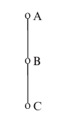
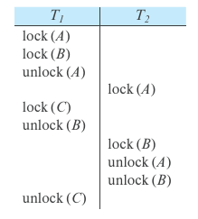
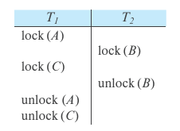
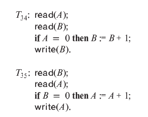
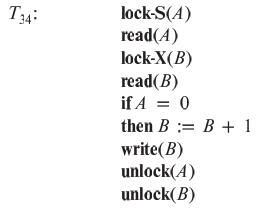
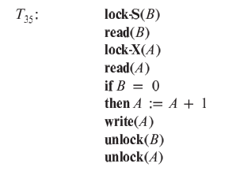
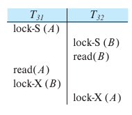
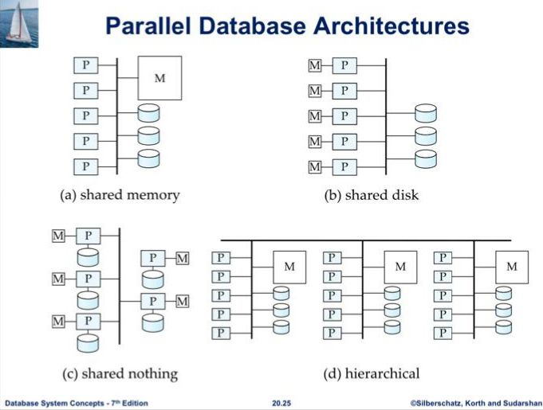

### 1-  Consider a database for an airline where the database system uses snapshot isolation.Describe a particular scenario in which a nonserializable execution occurs,but the airline may be willing to accept it in order to gain better overall performance.
### Answer:
Consider a web-based airline reservation system. There could be many concurrent requests to see the list of available flights and available seats in each flight and to book tickets. 
Suppose there are two users, **A** and **B**, concurrently accessing this web application, and only one seat is left on a flight.

Suppose that both user **A** and user **B** execute transactions to book a seat on the flight and suppose that each transaction checks the total number of seats booked on the 
flight and inserts a new booking record if there are enough seats left. Let `T₃` and `T₄` be their respective booking transactions, which run concurrently. Now `T₃` and `T₄` will see 
from their snapshots that one ticket is available and will insert new booking records. Since the two transactions do not update any common data item (tuple), snapshot isolation allows both transactions to commit. 
This results in an extra booking, beyond the number of seats available on the flight.

However, this situation is usually not very serious since cancellations often resolve the conflict; even if the conflict is present at the time the flight is to leave,
the airline can arrange a different flight for one of the passengers on the flight, giving incentives to accept the change. Using snapshot isolation improves the overall 
performance in this case since the booking transactions read the data from their snapshots only and do not block other concurrent transactions.

 ---
### 2- Show by example that there are schedules possible under the tree protocol that are not possible under the two-phase locking protocol, and vice versa.

#### Answer:
 **1. Tree Protocol**
- ***Definition:***
  The tree protocol is a concurrency control protocol used to manage locks in a hierarchical manner. It ensures that:
  - A transaction can lock a child node only after locking its parent.
  - Once a node is unlocked, it cannot be locked again during the same transaction.

- ***Advantages:***
  - Deadlock-free as it imposes a strict locking order.

- ***Disadvantages:***
  - Reduces concurrency because of the hierarchical locking order.
 

**2. Two-Phase Locking Protocol (2PL)**
- ***Definition:***
  The two-phase locking protocol ensures serializability by dividing the execution of transactions into two distinct phases:
  1. ***Growing Phase:*** Locks are acquired but not released.
  2. ***Shrinking Phase:*** Locks are released but no new locks are acquired.

- ***Advantages:***
  - Guarantees conflict-serializable schedules.

- ***Disadvantages:***
  - Deadlocks can occur due to lack of ordering constraints.

Consider the tree-structured database graph given below.

 Schedule possible under tree protocol but not under 2PL:

 

Schedule possible under 2PL but not under tree protocol:

 

---
## 3- Consider the following two transactions:

**Question:**  
Add lock and unlock instructions to transactions T₃₁ and T₃₂ so that they observe the two-phase locking protocol. Can the execution of these transactions result in a deadlock?

### Answer:
 a. Lock and unlock instructions:

 b. Execution of these transactions can result in deadlock. For example, consider the following partial schedule:
 

 The transactions are now deadlocked.
---

## 4- Failure Classification (Chapter 19: Recovery System)

Failures in database systems can be classified into the following types:

**1. Transaction Failure:**
- ***Logical Errors:***  
  The transaction cannot complete due to an internal error condition (e.g., invalid input, data constraint violation).
- ***System Errors:***  
  The database system terminates an active transaction due to an error condition (e.g., deadlock).

 **2. System Crash:**
- A power failure, hardware malfunction, or software failure causes the system to crash.
- Assumes a ***fail-stop model*** where non-volatile storage contents are not corrupted.

**3. Disk Failure:**
- A catastrophic failure (e.g., head crash) destroys all or part of disk storage.
- Failures are typically detectable using checksums or similar mechanisms.

**Summary:**
Each of these failure types requires specific recovery mechanisms to maintain the integrity and consistency of the database.

---

## 5- Parallel Database Architectures

Parallel database architectures differ in how they organize resources such as memory, processors, and disks to improve performance and scalability.

 1. **Shared-Memory Architecture**
- ***Description:*** All processors share a common memory space and access shared disks.
- *Example:*
  - A server with 16 cores where all cores share the same RAM and storage.
- ***Advantages:***
  - Low communication overhead between processors.
  - Simple to program and implement.
- ***Disadvantages:***
  - Scalability is limited due to contention for shared memory.
  - Typically limited to systems with up to 64–128 processors.
- **Use Case:** Suitable for small-scale systems.

 2. **Shared-Disk Architecture**
- ***Description:*** Each processor has its private memory but accesses a shared disk storage.
- *Example:*
  - A cluster of servers with independent RAM but connected to a centralized SAN (Storage Area Network).
- ***Advantages:***
  - Better fault tolerance, as data is centralized and accessible by all processors.
  - Suitable for systems requiring high data availability.
- ***Disadvantages:***
  - Bottlenecks can occur at the interconnection to the disk subsystem.
  - Higher communication costs compared to shared-memory systems.
- **Use Case:** Medium-scale systems with moderate parallelism.

 3. **Shared-Nothing Architecture**
- ***Description:*** Each node (processor) has its private memory and disk storage. Nodes communicate via a network.
- *Example:*
  - Distributed databases like Hadoop or Cassandra.
- ***Advantages:***
  - High scalability: can handle thousands of nodes.
  - No contention for memory or storage resources.
- ***Disadvantages:***
  - High communication overhead when accessing data on other nodes.
  - Complex to implement and manage.
- **Use Case:** Large-scale distributed systems.

 4. **Hierarchical Architecture**
- ***Description:*** Combines elements of shared-memory, shared-disk, and shared-nothing architectures.
- *Example:*
  - A data center with shared-nothing nodes, where each node is a shared-memory system.
- ***Advantages:***
  - Flexible and suitable for large-scale systems.
  - Can balance scalability and performance.
- ***Disadvantages:***
  - Complex to design and maintain.
- **Use Case:** Large-scale systems requiring hybrid solutions.

 **Summary Table**

| Architecture       | Memory Sharing | Disk Sharing | Scalability | Communication Overhead | Use Case                              |
|--------------------|----------------|--------------|-------------|------------------------|---------------------------------------|
| Shared-Memory      | Shared         | Shared       | Low         | Low                    | Small-scale systems                   |
| Shared-Disk        | Private        | Shared       | Medium      | Medium                 | Fault-tolerant, medium-scale systems  |
| Shared-Nothing     | Private        | Private      | High        | High                   | Large-scale, distributed systems      |
| Hybrid             | Mixed          | Mixed        | High        | Mixed                  | Custom workloads, cloud environments  |

---
## 6-  Blockchain: Definition, Properties, and Applications

 **Definition:**
A blockchain is a decentralized, distributed digital ledger that records transactions across multiple nodes in a network. Each transaction is stored in a block, and these blocks are linked using cryptographic hashes, forming a secure and tamper-resistant chain.

---

 **Properties of Blockchain:**

1. ***Decentralization:***
   - Transactions are verified and added by a distributed network of nodes without requiring a central authority.

2. ***Tamper Resistance:***
   - Altering a block requires changing all subsequent blocks, making tampering infeasible due to the computational effort required.

3. ***Irrefutability:***
   - Transactions are signed digitally, ensuring that participants cannot deny their actions.

4. ***Anonymity:***
   - Users are identified by public keys, which are not directly tied to real-world identities unless linked externally.

5. ***Consensus:***
   - Nodes agree on the validity of transactions using algorithms such as Proof of Work (PoW) or Proof of Stake (PoS).

---

 **Applications of Blockchain:**

1. ***Cryptocurrencies:***
   - Example: Bitcoin and Ethereum provide decentralized digital currencies without a central bank.

2. ***Supply Chain Management:***
   - Track the origin, authenticity, and movement of goods across the supply chain.

3. ***Health Care:***
   - Securely store and share medical records with patient consent.

4. ***E-Government:***
   - Transparent public records management and secure voting systems.

5. ***Finance and Trade:***
   - Cross-border payments, smart contracts, and decentralized finance (DeFi) applications.

6. ***Internet of Things (IoT):***
   - Enhance device security and enable autonomous machine-to-machine transactions.

7. ***Academic Records:***
   - Distribute and verify academic transcripts securely.

8. ***Loyalty Programs:***
   - Track and redeem rewards efficiently across platforms.

 ***Summary:***
Blockchain technology provides a secure, transparent, and efficient way to manage and verify transactions across various industries. Its unique properties make it a transformative tool for applications ranging from digital currencies to healthcare and supply chain management.

---
---
## 7- The Database Administrator (DBA) and Their Role in Managing System Security

The Database Administrator (DBA) is the central authority responsible for managing the database system, and their main tasks include:

1. **Account Creation**:
   - Creating new accounts and passwords for users or groups of users to enable access to the database system.

2. **Privilege Granting**:
   - Granting privileges to specific users based on their needs to use the system.

3. **Privilege Revocation**:
   - Revoking privileges that were previously granted to certain accounts.

4. **Security Level Assignment**:
   - Assigning a security clearance level to a user account based on the required permissions.

## DBA Roles:
- **Database Protection**:
  - The DBA is responsible for ensuring the overall security of the database system.
  - This is done by controlling access through the actions mentioned above.
  
- **Privilege Classification**:
  - Actions (2 and 3) are used to manage **discretionary authorization**.
  - Action (4) is used to manage **mandatory authorization**.
